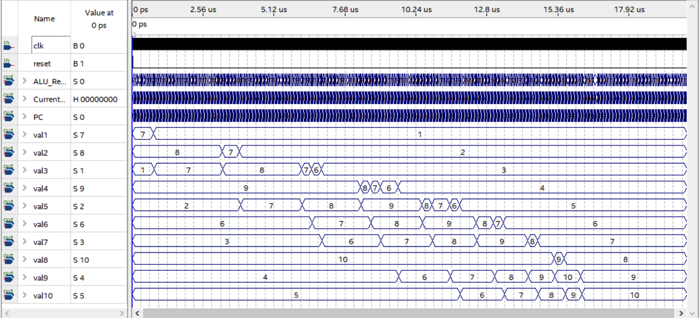

# Bubble Sort Algorithm in Single Cycle Processor #

## Background 
As part of my computer architecture learnings, here I implemented bubble sort algorithm in a Single Cycle Processor in Verilog. Verilog is a Hardware Development Language. It is commonly used in the design and verification of digital circuits at the register-transfer level of abstraction. It is also used in the verification of analog circuits and mixed-signal circuits, as well as in the design of genetic circuits. 

## Supporting Instructions
This implementation supports the following instructions:
- R-type instructions: add, sub, and, or, slt
- Memory: lw, sw
- Branching: beq
- Jump: j, jal, jr
- Additional: sll, addi
- Custom: swap

lw & sw work similar like MIPS, where lw loads an instruction into a register and sw saves an instruction into a register
beq enables branching to another instruction if condition matches.
jal allows processor to jump to new instruction and save previous “next PC” (PC+4) position in register[31] or $ra
jr allows processor to jump to instruction stored in register[31] representing $ra by jal.

## Customized 32 bits Instruction
"swap" is the customized MIPS procedure that was possible by creating a 32 bits instruction with [31:26] = 6’b111111

## Verilog Simulation
